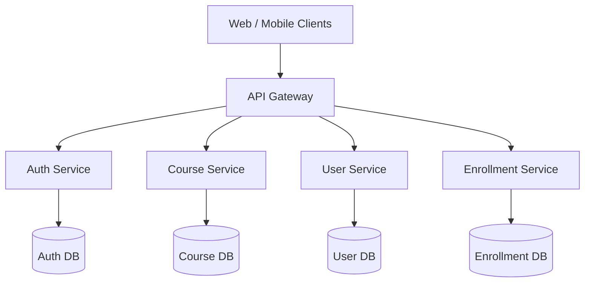

# Architecture Standards

This document defines the architectural principles and patterns for the Enterprise Learning Management System (LMS). All services must align with these guidelines to ensure reliability, scalability, and maintainability.

## 1. Microservices Architecture

The system is designed as a suite of collaborative, loosely coupled, and independently deployable microservices.

### Core Benefits
- **Independent Scalability**: Scale CPU/memory-intensive services (e.g., Course Service video transcoding or Enrollment reporting) without scaling the entire stack.
- **Fault Isolation**: A failure in the Course Service does not prevent users from authenticating via the Auth Service.
- **Technology Flexibility**: Different teams can select the best frameworks/languages for specific domains, though Java 21/Spring Boot 3 remains the default.

---

## 2. API Gateway Pattern

All client applications access backend microservices via a single entry point: the **API Gateway**.

### Responsibilities
- **Routing**: Forward requests to appropriate downstream services based on path mappings.
- **Authentication**: Intercept requests, validate JWT tokens, and inject authenticated user headers (e.g., `X-User-Id`, `X-User-Roles`) downstream.
- **Rate Limiting**: Protect backend systems from DDoS and abuse using bucket algorithms.
- **CORS Handling**: Centralized cross-origin resource sharing configuration.

> [!IMPORTANT]
> Downstream microservices must NOT be directly exposed to the public internet. They should only accept requests from the API Gateway or internal service-to-service communication channels.

---

## 3. Service Boundaries

Services are partitioned using Domain-Driven Design (DDD) principles, aligning with bounded contexts:

| Service Name | Bounded Context / Domain | Primary Responsibilities |
| :--- | :--- | :--- |
| **Auth Service** | Identity & Access Management | JWT Token issuance, authentication, user credential management, OAuth2 integration. |
| **User Service** | Profile Management | User profiles, student/instructor metadata, preferences, and account history. |
| **Course Service** | Content Management | Courses, categories, lectures, syllabus, video materials, quizzes, and attachments. |
| **Enrollment Service** | Student Progress | Course registrations, progress tracking, completions, and certificate issuance. |

### Inter-Service Communication
1. **Synchronous (REST / gRPC)**: Used strictly for real-time querying (e.g., fetching a student profile during enrollment creation). Use gRPC for high-performance internal communication.
2. **Asynchronous (Event-Driven / Kafka)**: Used for state propagation and side-effects. Example: When a student completes a course, the `Enrollment Service` publishes a `CourseCompletedEvent` which the `Certificate Service` consumes to generate a certificate.

---

## 4. Database-per-Service Principle

To ensure true loose coupling, **each microservice owns and controls its database schema**. 

### Rules
- **No Shared Databases**: No two services may read from or write to the same database instances or schemas.
- **Data Encapsulation**: A service can only access another service's data via its public APIs (REST/gRPC) or by consuming its domain events.
- **Distributed Transactions**: Avoid two-phase commits. Implement eventual consistency using the **Saga Pattern** or **Outbox Pattern** for workflows spanning multiple services.
