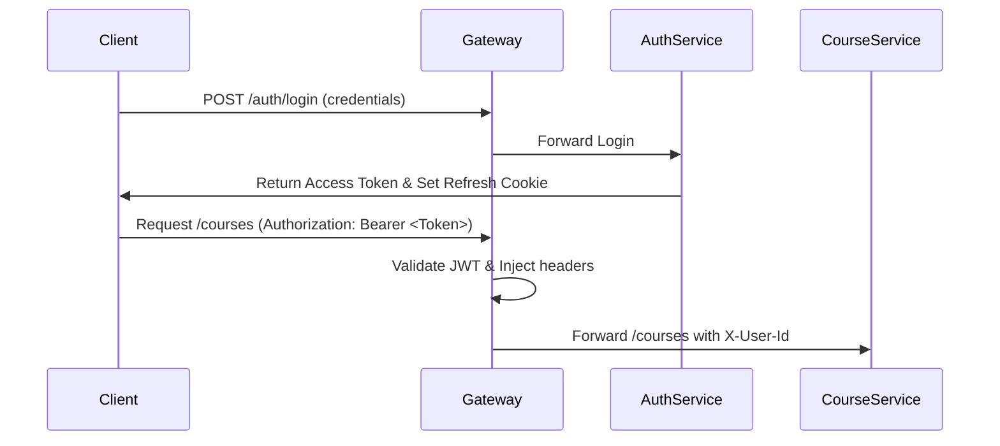

# Security Standards

Security is a primary concern for the Enterprise LMS. This document details the standards and practices required to secure user data, APIs, and overall infrastructure.

## 1. JWT Authentication

We utilize JSON Web Tokens (JWT) for stateless authentication.

### Token Specifications
- **Signing Algorithm**: HMAC SHA-256 (`HS256`) or asymmetric RSA (`RS256`).
- **Token Structure**:
  - **Header**: Standard signature details.
  - **Payload (Claims)**: Contains standard and custom claims:
    - `sub`: User identity (e.g., User ID or email).
    - `roles`: Collection of assigned user roles (e.g., `["ROLE_STUDENT", "ROLE_INSTRUCTOR"]`).
    - `exp`: Expiration epoch timestamp (Max 15 minutes for Access Tokens).
    - `iss`: Token issuer URI.
  - **Signature**: Verified against a secure environment secret key.
- **Refresh Tokens**: Stored securely in HttpOnly, Secure, and SameSite=Strict cookies with a longer lifespan (e.g., 7 days).



---

## 2. Password Hashing

Plaintext passwords must NEVER be saved, logged, or stored in transient cache systems.

### Hashing Requirements
- **Algorithm**: **BCrypt** (strongly preferred due to its built-in salt generation and computational work factor).
- **Work Factor (Strength)**: Set to a minimum of **12** to defend against brute-force attacks while maintaining acceptable server latency.
- **Salt Configuration**: Automatic secure random salt generation per password.
- **Code implementation (Spring Security)**:
  ```java
  @Bean
  public PasswordEncoder passwordEncoder() {
      return new BCryptPasswordEncoder(12);
  }
  ```

---

## 3. Role-Based Access Control (RBAC)

API access must be restricted based on authorization roles.

### Standard System Roles
1. **ROLE_STUDENT**: Access to view courses, purchase enrollments, check own progress, and take quizzes.
2. **ROLE_INSTRUCTOR**: Create and edit own courses, manage syllabus, publish quiz contents, and grade students.
3. **ROLE_ADMIN**: Global system configurations, user account suspensions, course approvals, and revenue auditing.

### Implementation Standard
Annotate controllers or methods using Spring Security's `@PreAuthorize` tags:
```java
@RestController
@RequestMapping("/api/courses")
public class CourseController {

    @PostMapping
    @PreAuthorize("hasRole('INSTRUCTOR') or hasRole('ADMIN')")
    public ResponseEntity<CourseResponse> createCourse(@Valid @RequestBody CourseRequest request) {
        ...
    }
}
```

---

## 4. OWASP Best Practices

To protect backend services from the OWASP Top 10 vulnerabilities, enforce the following:

- **Input Validation**: Use standard Spring Bean Validation (`jakarta.validation`). Sanitize all text fields to prevent Cross-Site Scripting (XSS).
- **SQL Injection Prevention**: Use Spring Data JPA/Hibernate or parameterized queries. Avoid constructing SQL strings dynamically via raw string concatenation.
- **Cross-Origin Resource Sharing (CORS)**: Set up strict CORS origins. Never use wildcard `*` domains in production environments.
- **Rate Limiting**: Configure rate limit limits on the API Gateway to prevent brute force login attempts and denial-of-service (DoS) conditions.
- **Sensitive Data Exposure**: Mask log messages. Never log passwords, tokens, API keys, or credit card info.
- **Transport Security**: Force TLS (HTTPS) on all API endpoints in production.
