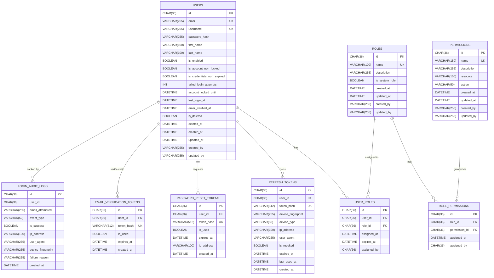

# Auth Service — Production Database Schema Design

> **Principal Backend Architect Review**
> Enterprise LMS — Authentication Service Only
> Stack: Java 21 · Spring Boot 3 · Spring Security · MySQL 8 · Flyway · Docker

---

## 1. ER Diagram



---

## 2. Table Design Reference

### 2.1 `users`
**Purpose**: Core identity entity. Stores credentials, account states, and lockout tracking.

| Column | Type | Constraints | Description |
|---|---|---|---|
| `id` | `CHAR(36)` | PK, NOT NULL | UUID v4 primary key |
| `email` | `VARCHAR(255)` | UNIQUE, NOT NULL | Login email; lowercase-enforced |
| `username` | `VARCHAR(100)` | UNIQUE, NOT NULL | Displayed handle |
| `password_hash` | `VARCHAR(255)` | NOT NULL | BCrypt-hashed password (12 rounds) |
| `first_name` | `VARCHAR(100)` | NOT NULL | Given name |
| `last_name` | `VARCHAR(100)` | NOT NULL | Family name |
| `is_enabled` | `TINYINT(1)` | NOT NULL, DEFAULT 1 | Account activated |
| `is_account_non_locked` | `TINYINT(1)` | NOT NULL, DEFAULT 1 | Lockout toggle |
| `is_credentials_non_expired` | `TINYINT(1)` | NOT NULL, DEFAULT 1 | Force password reset flag |
| `failed_login_attempts` | `INT` | NOT NULL, DEFAULT 0 | Reset to 0 on success |
| `account_locked_until` | `DATETIME` | NULL | Expiry for temporary locks |
| `last_login_at` | `DATETIME` | NULL | Successful session timestamp |
| `email_verified_at` | `DATETIME` | NULL | NULL = unverified |
| `is_deleted` | `TINYINT(1)` | NOT NULL, DEFAULT 0 | Soft delete flag |
| `deleted_at` | `DATETIME` | NULL | Soft delete timestamp |
| `created_at` | `DATETIME` | NOT NULL | Auto set on INSERT |
| `updated_at` | `DATETIME` | NOT NULL | Auto set on UPDATE |
| `created_by` | `VARCHAR(255)` | NULL | User UUID or 'SYSTEM' |
| `updated_by` | `VARCHAR(255)` | NULL | User UUID or 'SYSTEM' |

**Indexes**: `idx_users_email`, `idx_users_username`, `idx_users_is_deleted`

---

### 2.2 `roles`
**Purpose**: Defines system-level and custom roles.

| Column | Type | Constraints | Description |
|---|---|---|---|
| `id` | `CHAR(36)` | PK | UUID v4 |
| `name` | `VARCHAR(100)` | UNIQUE, NOT NULL | e.g., `ROLE_ADMIN` |
| `description` | `VARCHAR(255)` | NULL | Human-readable explanation |
| `is_system_role` | `TINYINT(1)` | DEFAULT 0 | Prevents deletion |

**Seeded roles**: `ROLE_STUDENT`, `ROLE_INSTRUCTOR`, `ROLE_ADMIN`, `ROLE_SUPER_ADMIN`

---

### 2.3 `permissions`
**Purpose**: Fine-grained resource-action access controls.

| Column | Type | Constraints | Description |
|---|---|---|---|
| `id` | `CHAR(36)` | PK | UUID v4 |
| `name` | `VARCHAR(150)` | UNIQUE, NOT NULL | e.g., `course:read` |
| `resource` | `VARCHAR(100)` | NOT NULL | e.g., `course`, `user` |
| `action` | `VARCHAR(50)` | NOT NULL | e.g., `read`, `write`, `delete` |

---

### 2.4 `user_roles`
**Purpose**: Many-to-many user ↔ role assignment with optional expiry.

| Column | Type | Description |
|---|---|---|
| `user_id` | `CHAR(36) FK` | References `users.id` |
| `role_id` | `CHAR(36) FK` | References `roles.id` |
| `expires_at` | `DATETIME` | Temporal role grants (e.g., trial instructor) |
| `assigned_by` | `CHAR(36)` | Admin who granted the role |

**Composite Unique**: `(user_id, role_id)`

---

### 2.5 `role_permissions`
**Purpose**: Grants permissions to roles (RBAC junction table).

**Composite Unique**: `(role_id, permission_id)`

---

### 2.6 `refresh_tokens`
**Purpose**: Multi-device session tracking. Tokens are stored as SHA-256 hashes (never plaintext) to prevent token replay on DB breach.

| Column | Type | Description |
|---|---|---|
| `token_hash` | `VARCHAR(512) UNIQUE` | SHA-256 hash of token |
| `device_fingerprint` | `VARCHAR(255)` | Canvas/browser fingerprint |
| `device_type` | `VARCHAR(50)` | `WEB`, `MOBILE`, `API` |
| `ip_address` | `VARCHAR(100)` | Client IP (IPv4/v6) |
| `is_revoked` | `TINYINT(1)` | Supports single logout |
| `expires_at` | `DATETIME` | 7 to 30 day TTL |
| `last_used_at` | `DATETIME` | Sliding expiry support |

---

### 2.7 `password_reset_tokens`
**Purpose**: Secure one-time password reset links with expiry.

| Column | Type | Description |
|---|---|---|
| `token_hash` | `VARCHAR(512) UNIQUE` | SHA-256 hash of reset token |
| `is_used` | `TINYINT(1)` | Invalidated after first use |
| `expires_at` | `DATETIME` | 15–60 minute window |

---

### 2.8 `email_verification_tokens`
**Purpose**: Email ownership confirmation at registration.

---

### 2.9 `login_audit_logs`
**Purpose**: Immutable append-only log of all auth events for SOC2/GDPR compliance.

| Column | Type | Description |
|---|---|---|
| `user_id` | `CHAR(36)` | NULL if user not found |
| `email_attempted` | `VARCHAR(255)` | Captures failed attempts even for non-existent emails |
| `event_type` | `VARCHAR(50)` | `LOGIN_SUCCESS`, `LOGIN_FAILED`, `LOGOUT`, `PASSWORD_RESET`, `TOKEN_REFRESH`, `ACCOUNT_LOCKED` |
| `is_success` | `TINYINT(1)` | Result classification |
| `failure_reason` | `VARCHAR(255)` | `INVALID_CREDENTIALS`, `ACCOUNT_LOCKED`, etc. |

---

## 3. Indexing Strategy

```sql
-- Performance: frequent query filters
CREATE INDEX idx_users_email         ON users(email);
CREATE INDEX idx_users_username      ON users(username);
CREATE INDEX idx_users_is_deleted    ON users(is_deleted);

-- Cleanup jobs: expired tokens
CREATE INDEX idx_refresh_tokens_user_id     ON refresh_tokens(user_id);
CREATE INDEX idx_refresh_tokens_expires_at  ON refresh_tokens(expires_at);
CREATE INDEX idx_refresh_tokens_is_revoked  ON refresh_tokens(is_revoked, expires_at);

CREATE INDEX idx_prt_user_id        ON password_reset_tokens(user_id);
CREATE INDEX idx_prt_expires_at     ON password_reset_tokens(expires_at);

-- Audit queries: filter by user and event
CREATE INDEX idx_audit_user_id      ON login_audit_logs(user_id);
CREATE INDEX idx_audit_event_type   ON login_audit_logs(event_type);
CREATE INDEX idx_audit_created_at   ON login_audit_logs(created_at);
CREATE INDEX idx_audit_ip_address   ON login_audit_logs(ip_address);
```

---

## 4. Security Considerations

| Threat | Mitigation |
|---|---|
| DB Breach → Token Theft | Refresh tokens stored as SHA-256 hashes only |
| Brute Force Login | `failed_login_attempts` + exponential lockout |
| Token Replay | `is_revoked` flag + token rotation on refresh |
| Password Leakage | BCrypt with cost factor ≥ 12 |
| SQL Injection | JPA + Flyway parameterized queries only |
| GDPR/Audit | `login_audit_logs` is immutable append-only |
| Concurrent Session Abuse | Per-device token rows, selective revocation |

---

## 5. Scalability Considerations

- **Read Replicas**: Direct all authentication token validation queries to MySQL read replicas.
- **Token Caching**: Cache JWT public keys and active sessions in Redis to reduce DB load on each request.
- **Partition Audit Logs**: `login_audit_logs` should be range-partitioned by `created_at` (monthly/quarterly) to prevent unbounded table growth.
- **Archive Old Records**: Schedule automated cleanup of expired tokens using batch jobs.
- **UUID Strategy**: Use UUID v7 (time-ordered) for primary keys in future versions to improve B-Tree index insert performance vs. random UUID v4.

---

## 6. Future Enhancements

- **OAuth 2.0 / OpenID Connect**: Add `oauth_accounts` table to link Google/GitHub/SSO providers.
- **MFA (Multi-Factor Authentication)**: Add `mfa_configs` table (TOTP, WebAuthn, SMS).
- **API Keys**: Add `api_keys` table for machine-to-machine authentication.
- **Session Management UI**: Surface active sessions to users via `refresh_tokens` device data.
- **Risk-Based Authentication**: Build on top of `login_audit_logs` to flag unusual IPs or device patterns.
