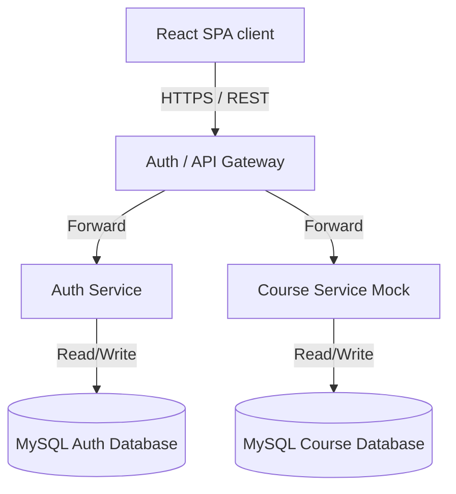

# System Architecture & Design Specification

This document details the system design, frontend structure, backend microservices, security boundaries, and containerized topology of the Enterprise Learning Management System (LMS).

---

## 1. System Topology Overview
The AetherLMS platform is designed as a distributed microservice network, utilizing a decoupled Single Page Application (SPA) for the user interface, separate backend services, and isolated databases per service.



---

## 2. Frontend Architecture
The frontend client is built as an optimized Single Page Application using:
*   **Vite**: Next-generation bundler facilitating Hot Module Replacement (HMR) and fast build processes.
*   **React 19**: Component-driven UI framework using functional components and custom hooks.
*   **React Router v6**: Dynamic path matching, page-based layouts, and route navigation guards.
*   **Tailwind CSS v3**: Utility-first CSS styling framework paired with custom CSS custom properties (variables) for design tokens.

### Folder Structure & Modularity
The client source files follow a modular design:
*   `src/components/ui/`: Contains stateless reusable UI elements (Buttons, Tables, Alerts, Modals) mapping the design tokens.
*   `src/layouts/`: AppLayout wrapping Navbar, collapsible Sidebar, main viewport, and Footer.
*   `src/pages/`: Page views loaded on route changes.
*   `src/styles/`: System-wide styling tokens (`variables.css`) and global utility definitions (`utilities.css`).

---

## 3. Backend Microservices Architecture
Backend services adhere to the layered architecture pattern:

```
Controller (REST API) ➔ Service (Business Logic) ➔ Repository (Persistence/JPA) ➔ Database
```

### Key Architectural Guidelines
1.  **Microservice Autonomy**: Services are decoupled. The `auth-service` owns identity; other services query identity details using event messaging or tokens, never direct database lookups.
2.  **Database-per-Service**: Each service owns its schema and cannot connect directly to other schemas.
3.  **DTO Isolation**: Raw database JPA entities are never exposed in REST Controllers. Services convert domain models into immutable Java `record` types (DTOs) before returning them.
4.  **Constructor Dependency Injection**: Dependencies are marked `final` and injected via constructors using Lombok `@RequiredArgsConstructor` annotation. `@Autowired` on fields is strictly prohibited.

---

## 4. Security Architecture
AetherLMS follows strict OWASP guidelines:
*   **Stateless Authentication**: Users log in to receive an access token (JWT) and a refresh token.
*   **Refresh Token Rotation**: Refresh tokens are returned inside secure, HttpOnly, SameSite cookies. The backend rotates these tokens upon usage to prevent replay attacks.
*   **Password Hashing**: BCrypt encryption algorithm is enforced on all passwords with a work factor of 12.
*   **Role-Based Access Control (RBAC)**: Endpoint matches inside `SecurityFilterChain` allow/deny requests matching specific user roles (`ROLE_STUDENT`, `ROLE_INSTRUCTOR`, `ROLE_ADMIN`).

---

## 5. Deployment Architecture
*   **Dockerization**: Every service is containerized using multi-stage builds.
*   **Local Orchestration**: Docker Compose registers networking bridges, environment variables, health check thresholds, and persistent volumes.
*   **CI/CD pipelines**: Enforce Checkstyle, PMD, SpotBugs static analysis checks, and Vitest/JUnit test coverage gates on all code branches.
