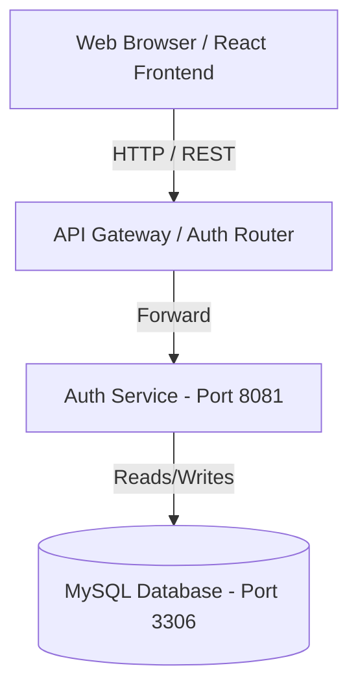

# High-Level Architecture Design

This document details the high-level architecture design of the Enterprise Learning Management System (AetherLMS).

## System Context Diagram
AetherLMS is designed as a decoupled, microservices-ready modular stack.

## Key Components

### 1. React Frontend (Port 5173)
*   **Technology Stack**: React 19, Vite 8, React Router 6.
*   **Role**: Handles user interaction, dashboard view, course browser, and forms. Performs local validation, stores stateless access tokens, and securely relays authentication requests.

### 2. Authentication Service (Port 8081)
*   **Technology Stack**: Java 21, Spring Boot 3, Spring Security 6.
*   **Role**: Central Identity Provider (IdP). Manages user registration, login, email verification, passwords, and RBAC (Role-Based Access Control).
*   **Tokenization**: Generates short-lived JWT access tokens and long-lived rotated refresh tokens.

### 3. Database Layer (Port 3306)
*   **Technology Stack**: MySQL 8.
*   **Role**: Persistent storage of users, roles, permissions, audit logs, and tokens. Governed by Flyway migration scripts.
